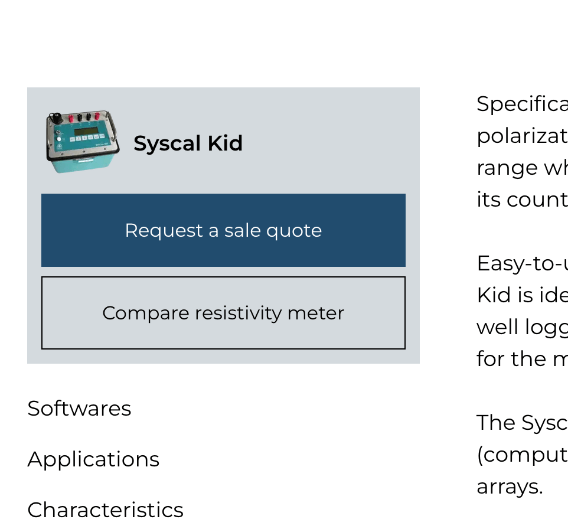

# IRIS Instrument

## Guides

### Bloc "Appel à action"

Pour afficher un bloc "Appel à action" au dessus de la table des matières, il faut créer un bloc "Appel à action" dans la page et le mettre en première position dans la liste des blocs.

# Osuny

[Documentation officielle sur developers.osuny.org](https://developers.osuny.org)

This project is tested with BrowserStack.
